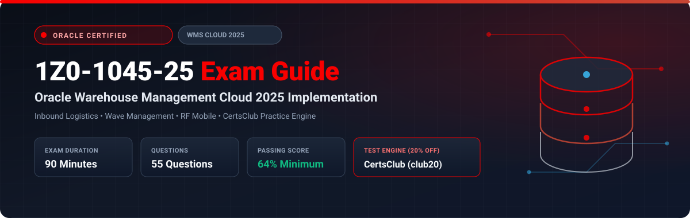

  

# Oracle Warehouse Management Cloud 2025 Implementation Professional (1Z0-1045-25) Exam Study Guide & Practice Test Resource Portal

[-f80000?style=for-the-badge&logo=oracle&logoColor=white)](https://education.oracle.com/)
[-f80000?style=for-the-badge&logo=oracle)](https://education.oracle.com/)

[-28a745?style=for-the-badge&logo=shield)](https://www.certsclub.com/oracle/)

---

## 1. Exam Overview & Candidate Profile

The **Oracle Warehouse Management Cloud 2025 Implementation Professional (1Z0-1045-25)** exam confirms that a consultant can successfully configure, deploy, and support Oracle WMS Cloud (formerly LogFire). Topics include facility setup, inbound shipments and ASN processing, putaway rule hierarchies, inventory tracking with license plate numbers (LPNs), wave execution, picking and packing strategies, shipping management, and mobile RF gun screen configurations.

Passing 1Z0-1045-25 grants the **Oracle Warehouse Management Cloud 2025 Certified Implementation Professional** credential.

### Target Candidate Profile & Career Roles
* **WMS Cloud Functional & Technical Consultants**
* **Supply Chain Logistics Architects**
* **Distribution Center Systems Specialists**

---

## 2. Key Exam Specifications

| Parameter | Official Specification |
| :--- | :--- |
| **Exam Code** | 1Z0-1045-25 |
| **Exam Title** | Oracle Warehouse Management Cloud 2025 Implementation Professional |
| **Associated Credential** | Oracle Warehouse Management Cloud 2025 Certified Implementation Professional |
| **Duration** | 90 Minutes |
| **Number of Questions** | 55 Questions |
| **Passing Score** | 64% |
| **Question Format** | Multiple Choice (Single and Multiple Select) |
| **Delivery Vendor** | Pearson VUE / Oracle University Online Remote Proctoring |
| **Recommended Practice Test Engine** | **[1Z0-1045-25 Practice Test - CertsClub](https://www.certsclub.com/oracle/)** (Coupon: `club20` for 20% off) |

---

## 3. Official Blueprint & Exam Domain Breakdown

| Domain Code | Domain Title | Weighting | Key Competencies Covered |
| :--- | :--- | :---: | :--- |
| **1.0** | **WMS Cloud Foundations & Master Data** | **20%** | Companies, Facilities, Location Master; Item Master, Categories, and Units of Measure (UOM); Vendors, Customers, and Carriers. |
| **2.0** | **Inbound Operations & Putaway Rules** | **25%** | Inbound Shipments, Purchase Orders, ASNs; Receiving workflows (PO, ASN, Blind); Putaway types and Putaway priority rules. |
| **3.0** | **Inventory Management & LPN Tracking** | **20%** | Inbound LPNs (IBLPN) vs Outbound LPNs (OBLPN); Cycle Counting; Inventory Adjustments; Replenishment tasks (Top-off, Min-Max). |
| **4.0** | **Outbound Fulfillment, Wave & Picking** | **25%** | Orders, Waves, and Wave Templates; Allocation rules; Picking methodologies (Cluster picking, Batch picking, Zone picking); Packing and Shipping. |
| **5.0** | **Mobile RF Configuration & System Integration** | **10%** | Configuring RF screen parameters, Barcode parsing rules, User permissions, XML/REST integration interfaces. |

---

## 4. Scenario-Based Demo Question & Explanation

### Question 1: Putaway Rule Priority
**Scenario:** A warehouse requires all refrigerated pharmaceutical goods to be directed to cold-storage rack locations upon receiving, while general ambient products are directed to bulk floor storage. 

How does Oracle WMS Cloud determine the target location during putaway execution?

A) Alphabetical location code order.  
B) Evaluating the sequential **Putaway Priority Rules** configured for the facility, matching item/item group criteria against eligible location types.  
C) Randomly selecting the nearest empty location.  
D) Putaway locations must be manually typed into the RF gun.  

**Correct Answer:** **B**

**Detailed Explanation:**
* Oracle WMS Cloud uses a priority-based rule engine for putaway. The system evaluates rules in sequence based on priority number, matching criteria such as item velocity, putaway type, and storage requirements against location attributes.

---

## 5. Recommended Preparation Strategy & Practice Testing Engine

1. **Simulate Inbound & Outbound Flows:** Practice receiving ASNs, executing waves, and packing OBLPNs in an Oracle WMS Cloud environment.
2. **Practice with Full-Length Mock Exams:** Use **[CertsClub Oracle 1Z0-1045-25 Practice Tests](https://www.certsclub.com/oracle/)**.
   * Comprehensive coverage of wave allocation rules, replenishment, and RF screens.
   * Enter discount coupon code **`club20`** at checkout on [CertsClub](https://www.certsclub.com/oracle/) for an immediate 20% discount.

---

## 6. Official Documentation & References

* [Oracle Warehouse Management Cloud Documentation](https://docs.oracle.com/en/cloud/saas/supply-chain-management/wms/)
* [Oracle University 1Z0-1045-25 Exam Page](https://education.oracle.com/)
* [CertsClub 1Z0-1045-25 Practice Engine](https://www.certsclub.com/oracle/)
